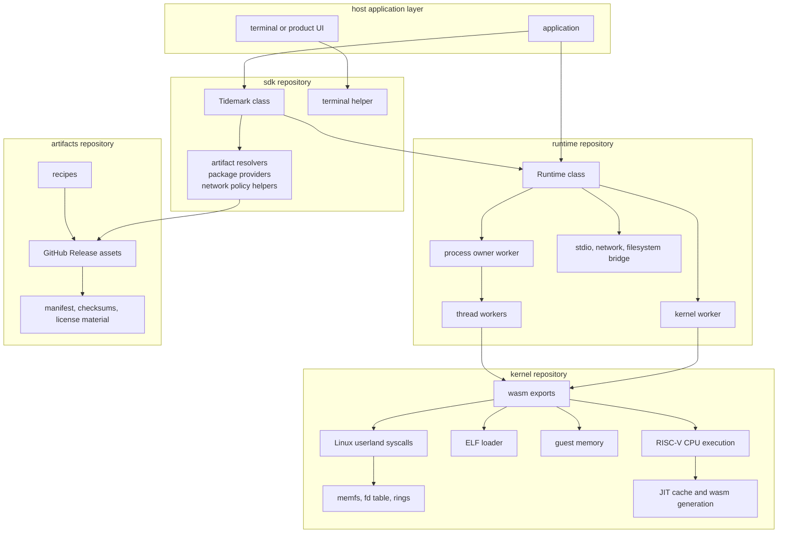
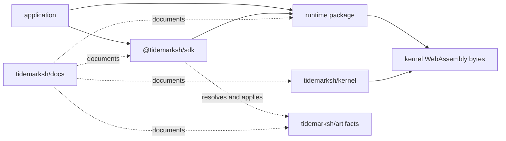

# Architecture

This page is the entry point for Tidemark's architecture. The detailed pages
under this section describe the execution model, state movement, filesystem
layering, repository boundaries, and artifact distribution.

Tidemark is a browser-hosted RISC-V Linux userland environment. The key
architectural choice is that guest-visible Linux and RISC-V behavior lives in a
Rust kernel compiled to WebAssembly, while browser execution machinery lives in
a TypeScript runtime.

## System Shape

There are two important consequences:

- Kernel behavior is about guest-visible execution and Linux compatibility.
- Runtime behavior is about worker orchestration, state movement, and browser
  host integration.

The SDK and artifacts repositories sit above those layers. They make the system
usable by applications without pushing package or distribution policy into the
kernel or generic runtime.

## Architecture Pages

- [Execution Model](architecture/execution-model.md): runtime creation,
  process startup, worker topology, step/status flow, fork/vfork/execve, and
  host I/O.
- [State And Filesystem](architecture/state-and-filesystem.md): state owners,
  filesystem layers, kernel-worker RPC, snapshots, runtime reads, and artifact
  release state.
- [Boundaries](architecture/boundaries.md): ownership matrix and practical
  repository rules.

## Repository Dependency Direction

The current SDK package depends on the local runtime package in the workspace.
The runtime does not import the kernel Rust crate directly; it receives kernel
WebAssembly bytes through `Runtime.create`.

## Control Planes

| Plane | Current owner | Examples |
|---|---|---|
| Guest execution semantics | Kernel | RISC-V decode/dispatch, ELF, syscall behavior, guest memory access. |
| Kernel state exports | Kernel | WebAssembly exports for kernel, thread, and memfs entry points. |
| Worker orchestration | Runtime | Kernel worker, process owner workers, thread workers, worker pool. |
| Runtime state movement | Runtime | `KernelRuntimeState`, fd/OFD snapshots, pipe slots, socket state snapshots, child-exit records. |
| Filesystem layering | Runtime and SDK | Runtime file layers and snapshots; SDK artifact layer installation. |
| Artifact distribution | Artifacts | Release payloads, manifests, checksums, build info, license bundles. |
| Product policy | SDK or application | Package provider choice, network policy, artifact origins, UI behavior. |

## Why This Is Not A Simple Emulator Package

A small emulator package can often expose one function like `run(binary)`. The
current Tidemark implementation has more moving parts because guest programs can
interact with filesystem state, process state, pipes, sockets, signals, child
processes, dynamic startup files, and host networking.

The runtime therefore has to preserve ordering across:

- kernel-worker RPCs,
- process owner state,
- thread-worker status messages,
- fd/OFD and pipe snapshots,
- fork/vfork/exec transitions,
- filesystem snapshots and page-cache state,
- stdio and network bridge events.

Those are not UI concerns. They are the browser-side substrate needed to let the
kernel's guest-visible behavior continue across workers and asynchronous host
events.
