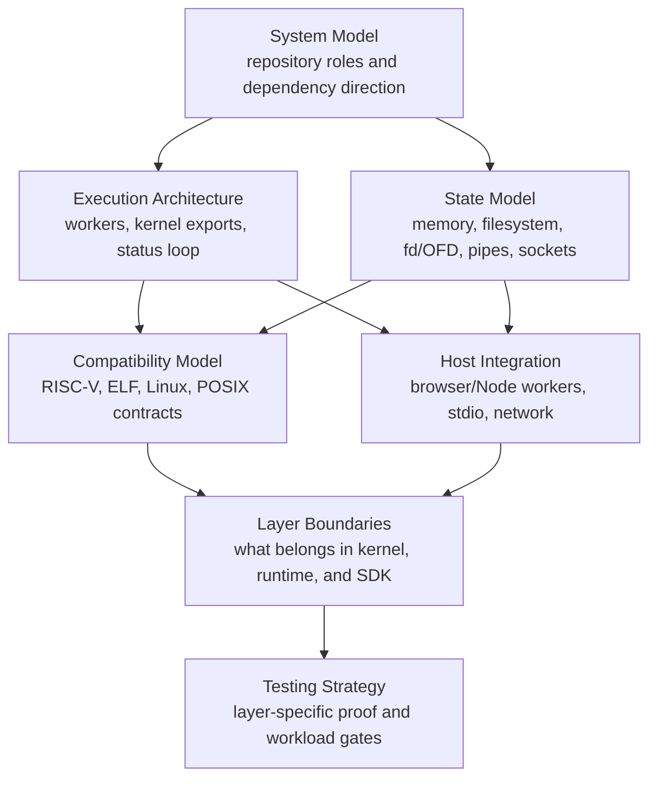

# Architecture Overview

Tidemark is a browser-hosted RISC-V Linux userland environment. Its architecture
is about making Linux-style guest execution survive inside WebAssembly, browser
workers, SharedArrayBuffer-backed memory, and host application policy.

The most important split is semantic ownership versus host orchestration:

- The kernel owns guest-visible RISC-V, ELF, Linux syscall, process,
  filesystem, memory, signal, pipe, socket, and thread behavior.
- The runtime owns worker orchestration, kernel WebAssembly instantiation,
  status handling, state movement, filesystem snapshots, stdio, and network
  bridge plumbing.
- The SDK owns application-facing ergonomics, command resolution, file helpers,
  provider policy, and optional network/proxy helpers.

## Architecture Map

## Pages

- [System Model](architecture/system-model.md): the repository and layer model
  that separates guest semantics, browser orchestration, and application
  policy.
- [Execution Architecture](architecture/execution-architecture.md): runtime
  creation, worker topology, kernel exports, status-driven execution,
  thread-worker scheduling, and fork/vfork/execve handoff transitions.
- [State Model](architecture/state-model.md): guest memory, SharedArrayBuffer
  use, page-cache and filesystem snapshots, fd/OFD state, pipe state, socket
  state, and kernel-worker RPC.
- [Compatibility Model](architecture/compatibility-model.md): how RISC-V,
  ELF, Linux syscall, and POSIX behavior are treated as compatibility
  contracts.
- [Host Integration](architecture/host-integration.md): how browser and Node
  worker APIs, stdio, filesystem calls, and network bridges connect to the
  runtime without becoming guest semantics.
- [Layer Boundaries](architecture/layer-boundaries.md): what belongs in
  kernel, runtime, SDK, and application/provider code.
- [Testing Strategy](architecture/testing-strategy.md): which tests prove each
  layer and how workload checks relate to lower-level gates.

## Why This Is Not A Simple Emulator Package

A small emulator package can often expose one function like `run(binary)`. The
current Tidemark implementation has more moving parts because guest programs can
interact with filesystem state, process state, pipes, sockets, signals, child
processes, dynamic startup files, and host networking.

The runtime therefore has to preserve ordering across:

- kernel-worker RPCs,
- process owner state,
- thread-worker status messages,
- fd/OFD and pipe snapshots,
- fork/vfork/exec transitions,
- filesystem snapshots and page-cache state,
- stdio and network bridge events.

Those are not UI concerns. They are the browser-side substrate needed to let the
kernel's guest-visible behavior continue across workers and asynchronous host
events.
