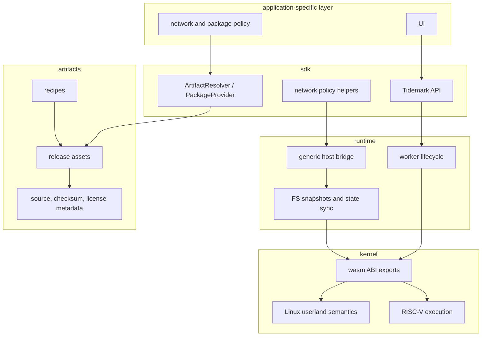

# Boundaries

This page defines what belongs in each public repository based on the current
implementation.

## Ownership Matrix

| Concern | Kernel | Runtime | SDK | Artifacts |
|---|---|---|---|---|
| RISC-V instruction behavior | Owns | Uses through wasm exports | Does not own | Does not own |
| ELF loading | Owns | Supplies executable bytes | Resolves executable path and bytes | May distribute payloads |
| Linux syscall behavior | Owns | Orchestrates blocking and state movement | Does not define | Does not define |
| Worker lifecycle | Does not own | Owns | Uses | Does not own |
| Process orchestration | Defines guest-visible effects | Owns browser-side lifecycle and scheduling | Provides high-level process API | Does not own |
| Filesystem semantics | Owns guest-visible memfs/fd behavior | Owns runtime snapshots and RPC | Applies files and artifact layers | Builds payloads |
| Package resolution | Does not own | Does not own | Owns provider abstraction | Supplies release assets |
| Artifact provenance | Does not own | Does not own | Consumes and verifies | Owns release metadata |
| Network policy | Does not own | Exposes bridge substrate | Exposes policy/proxy helpers | Does not own |
| Product UI | Does not own | Does not own | May help integration | Does not own |

## Boundary Diagram

## Practical Rules

Kernel changes should be justified by RISC-V, ELF, memory, filesystem,
process, signal, socket, thread, or Linux userland compatibility behavior.

Runtime changes should be justified by worker orchestration, state
synchronization, process lifecycle, host bridge, filesystem snapshot, or
network bridge behavior.

SDK changes should be justified by application ergonomics, artifact and package
provider interfaces, network policy integration, terminal integration, or host
tooling.

Artifacts changes should be justified by release recipe, manifest, checksum,
license, source metadata, or workflow automation needs.

## Anti-Coupling Rule

A lower layer should not branch on a product or workload name. In practice:

- Kernel should not need to know whether a file came from Node.js, Go, apt, or
  a static layer.
- Runtime should not need package-manager-specific code to coordinate workers.
- SDK providers may know package and artifact identities, because that is their
  job.
- Artifacts may encode upstream package and toolchain identities, because those
  identities define release payloads.

This keeps compatibility behavior testable independently from product
provisioning policy.
