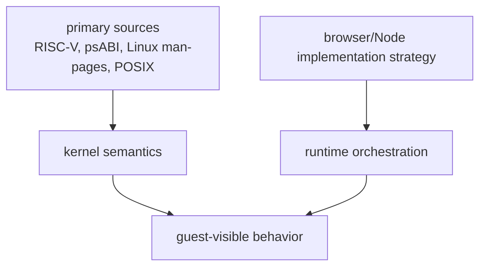

# Compatibility Model

Tidemark does not try to be a full Linux kernel. It implements a browser-hosted
RISC-V Linux userland environment whose supported guest-visible behavior should
match the relevant primary source.

## Semantic Compatibility Versus Host Strategy

The compatibility model separates two questions:

- What should a guest program observe?
- How can the browser/Node runtime implement that behavior?

The first question belongs to the kernel and must be grounded in RISC-V, ELF,
Linux, POSIX, and project compatibility tests. The second question belongs to
the runtime and SDK as long as it does not change guest-visible behavior.

For example, using workers, SharedArrayBuffer, typed messages, or a host
network bridge is an implementation strategy. A guest-visible syscall return
value, fd rule, signal behavior, or memory mapping rule is a compatibility
contract.

## Reference Sources

| Area | Reference source |
|---|---|
| RISC-V ISA | [RISC-V ratified specifications](https://docs.riscv.org/reference/home/index.html) |
| RISC-V ELF and calling convention | [RISC-V ELF psABI document](https://github.com/riscv-non-isa/riscv-elf-psabi-doc) |
| Linux syscalls | [Linux man-pages project](https://man7.org/linux/man-pages/) |
| Portable system interfaces | [POSIX System Interfaces](https://pubs.opengroup.org/onlinepubs/9799919799/functions/contents.html) |
| WebAssembly execution target | [WebAssembly specifications](https://webassembly.org/specs/) |
| RISC-V ISA tests | [riscv-tests](https://github.com/riscv-software-src/riscv-tests) |
| Linux compatibility tests | [Linux Test Project](https://github.com/linux-test-project/ltp) |

Workload traces are useful for debugging, but they should not be the authority
for syscall, ABI, ISA, or compatibility behavior. A workload may expose a bug;
the fix still needs to reconcile with the relevant source.

## Compatibility Evidence

The current repositories reflect this split through separate gates for RISC-V
instruction behavior, syscall families, LTP classification, runtime ownership,
state synchronization, worker scheduling, filesystem snapshots, fork/execve,
host bridges, and consumer-style workload composition.

The purpose is to avoid treating a consumer command as the first definition of
correct behavior. The consumer command should confirm that the lower-level
contract holds in a realistic composition.
