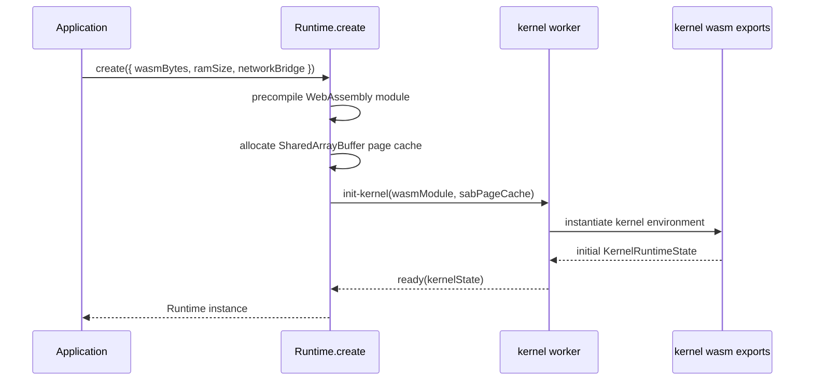
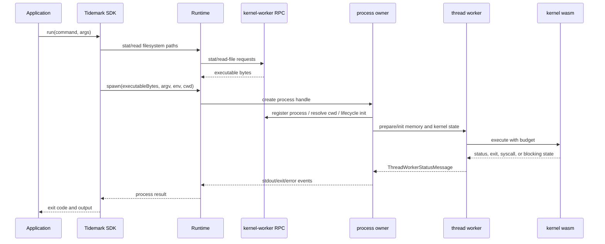
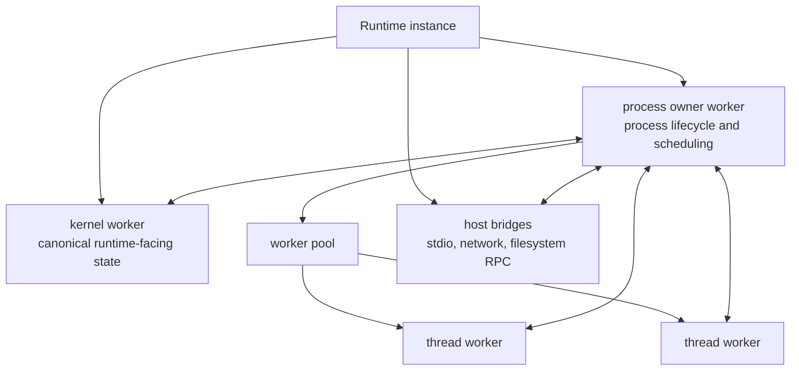
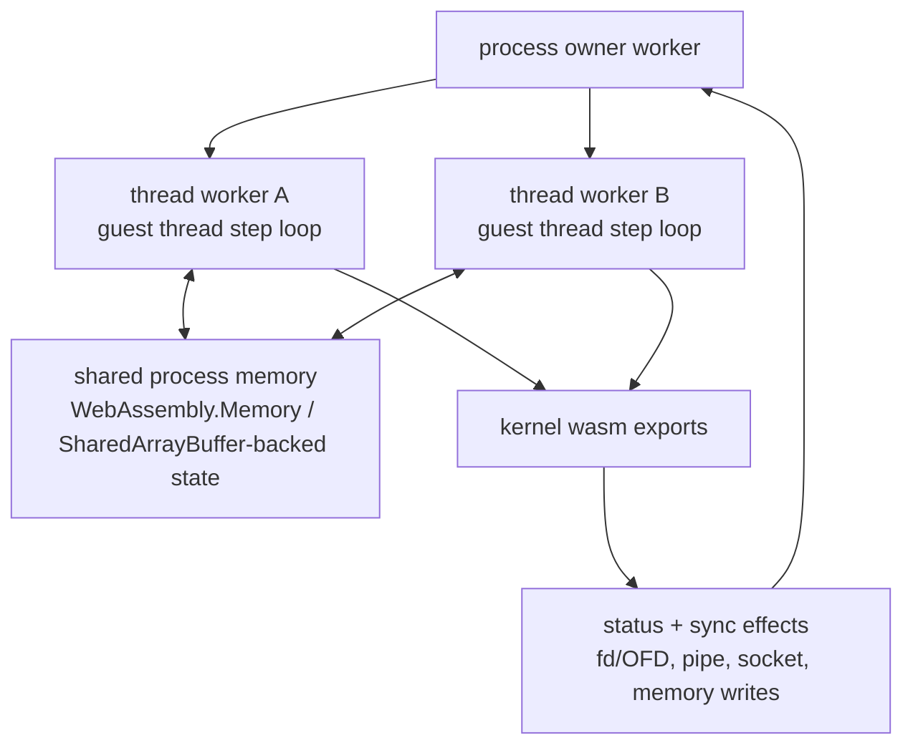
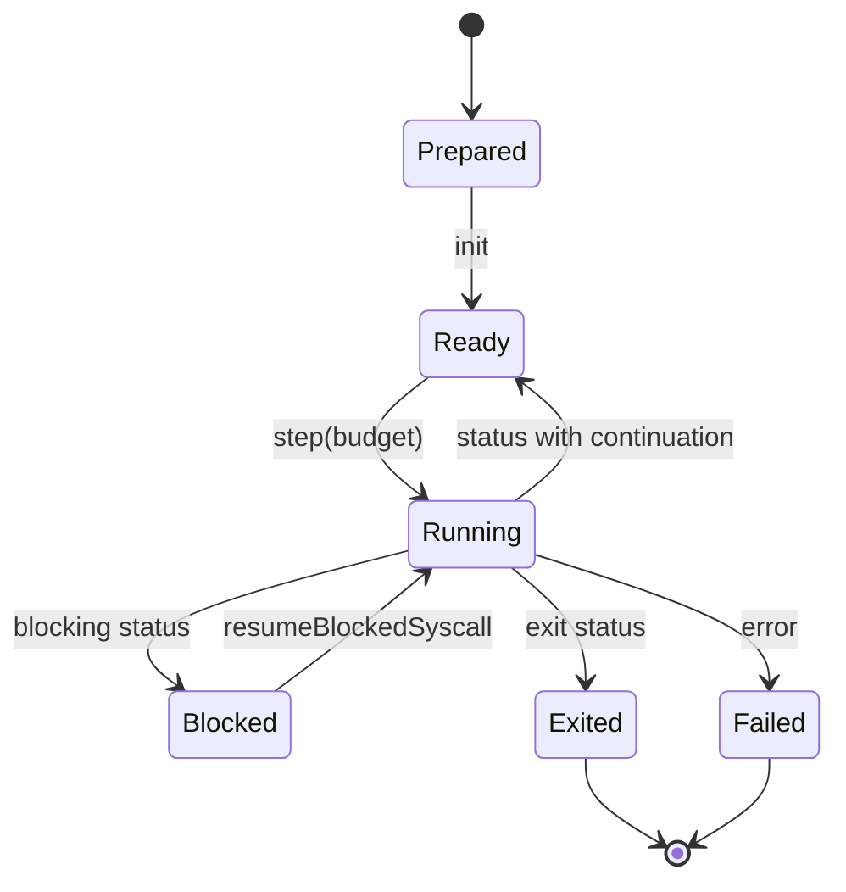
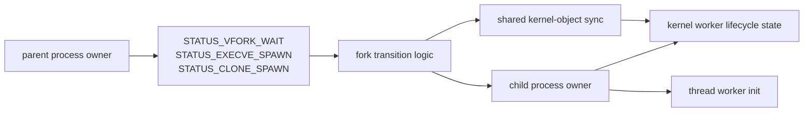

# Execution Architecture

This page describes how the current implementation creates a runtime, starts a
guest process, and moves execution between workers and kernel WebAssembly.

## Runtime Creation

`Runtime.create` receives kernel WebAssembly bytes and initializes a runtime
instance. The current implementation precompiles the module, allocates a
SharedArrayBuffer-backed page cache, creates a kernel worker, and sends an
`init-kernel` request.

The runtime owns the JavaScript/TypeScript worker lifecycle. The kernel owns the
guest-visible behavior once execution enters kernel exports.

## Kernel ABI And Status Codes

The kernel exports status codes, syscall numbers, constants, and process/thread
entry points through its WebAssembly ABI. The runtime reads those exports rather
than maintaining an independent copy of the same contract.

The current ABI includes status categories for filesystem work, futex waits,
pipe waits, epoll waits, vfork waits, exec-style process creation, clone-style
thread or process creation, sleep, sockets, and JIT readiness. Runtime message
contracts carry kernel runtime state alongside those statuses.

This makes the status boundary explicit: kernel execution stops with a status,
and the runtime decides which browser-side orchestration step is needed next.

## Process Startup

The SDK and runtime expose different levels of process startup.

- The SDK accepts a command name, resolves it against a guest `PATH`, handles
  simple shebang fallback through `/bin/sh`, reads executable bytes, and calls
  the runtime.
- The runtime accepts executable bytes and lower-level process options.
- The worker layer prepares memory, filesystem state, process identity, stdio,
  and thread-worker execution.

This sequence is intentionally more explicit than a single `run` call. The
runtime has to coordinate browser workers, kernel state, guest memory,
filesystem state, and host I/O.

## Worker Topology

The runtime implementation reflects this topology through separate roles for
kernel-worker state, process ownership, scheduling, thread execution, host I/O,
and shared-state synchronization. Those roles may move during refactoring, but
the architectural ownership should remain visible.

## Thread Workers

Thread workers are the runtime substrate for guest thread execution. A
thread-worker executes a single guest thread against shared process memory and
returns explicit status and synchronization data to the process owner. The
runtime can then coordinate blocking, resume, signals, fork/exec transitions,
filesystem effects, and process lifecycle without making the kernel depend on
browser worker APIs.

This design supports workloads that expect a threaded Linux userland substrate:
language runtimes, compiler drivers, build tools, thread pools, futex waits,
signal interruption, and child process orchestration. Those workloads exercise
the substrate; they are not special cases in the runtime architecture.

## Step And Status Loop

Thread workers receive `prepare`, `init`, and `step` messages. A step includes a
budget and the kernel state required to continue. The thread worker returns
status messages that can include register details, syscall number, kernel
state, fd/OFD snapshots, pipe slots, socket snapshots, guest memory writes,
kernel memory writes, sync effects, child-exit records, and blocking hints.

The runtime receives enough structured state to decide whether to continue,
resume a blocked syscall, publish state to the kernel worker, propagate child
exit records, or tear down a process tree.

## Fork, Vfork, And Execve

Fork-style operations are not only memory copies. They also involve fd/OFD
ownership, pipe state, process identity, child-exit records, cwd and executable
state, and worker readiness ordering.

The current implementation exposes this as an explicit process handoff
protocol:

- kernel exports describe spawn kind and pending handoff state,
- runtime worker modules build or rehydrate child process owners,
- kernel-worker messages resume vfork parents and synchronize shared state,
- tests cover vfork/execve success, failure, parent restoration, and fd/OFD
  isolation cases.

The handoff protocol has to cover parent suspension and resume, child
creation, fd/OFD visibility, pipe visibility, child-exit records, and failure
rollback. Tests should cover successful transitions, failure restoration,
descriptor isolation, pipe behavior, and parent-resume ordering.
