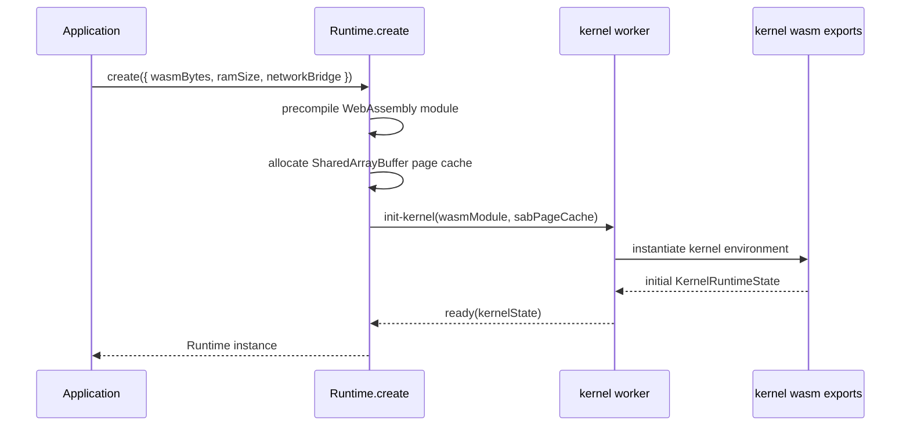
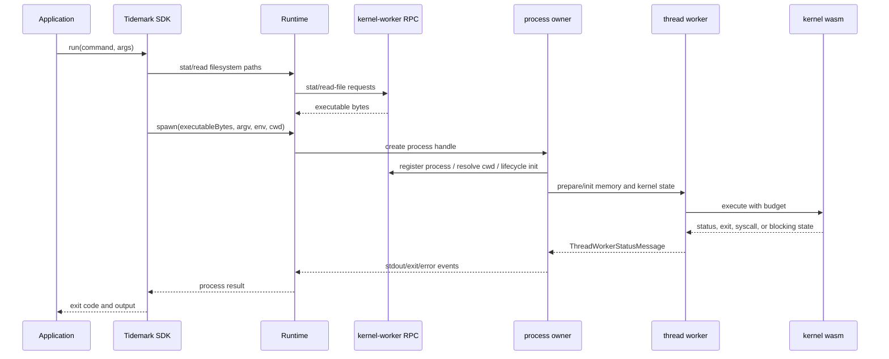
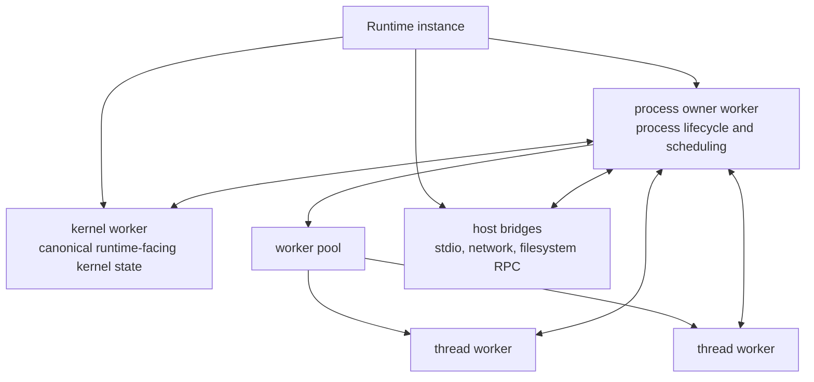
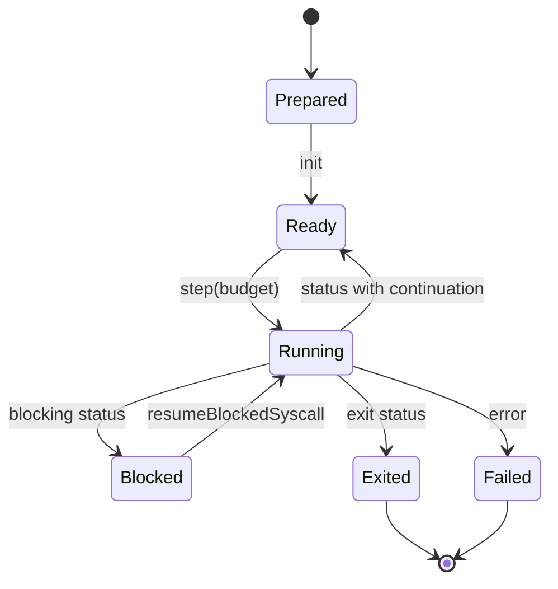
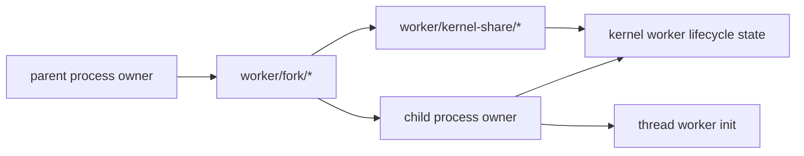

# Execution Model

This page describes how the current implementation creates a runtime, starts a
guest process, and moves execution between the runtime and kernel.

## Runtime Creation

`Runtime.create` receives kernel WebAssembly bytes and initializes a runtime
instance. The current implementation precompiles the module, allocates a
SharedArrayBuffer-backed page cache, creates a kernel worker, and sends an
`init-kernel` request.

The runtime owns the JavaScript/TypeScript worker lifecycle. The kernel owns the
guest-visible behavior once execution enters kernel exports.

## Process Startup

The SDK and runtime expose different levels of process startup.

- The SDK accepts a command name, resolves it against a guest `PATH`, handles
  simple shebang fallback through `/bin/sh`, reads executable bytes, and calls
  the runtime.
- The runtime accepts executable bytes and lower-level process options.
- The worker layer prepares memory, filesystem state, process identity, stdio,
  and thread-worker execution.

This sequence is intentionally more explicit than a single `run` call. The
runtime has to coordinate browser workers, kernel state, guest memory,
filesystem state, and host I/O.

## Worker Topology

The runtime source tree reflects this topology:

- `kernel-worker/` handles kernel-worker filesystem state, process control,
  lifecycle, primitives, and shared-state sync.
- `worker/` handles process creation, lifecycle, fork variants, scheduler,
  message handling, kernel-share logic, stdio, and process I/O.
- `thread-worker/` handles execution, blocking, sessions, signals, and sync
  effects.

## Step And Status Loop

Thread workers receive `prepare`, `init`, and `step` messages. A step includes a
budget and the kernel state required to continue. The thread worker returns
status messages that can include register details, syscall number, kernel
state, fd/OFD snapshots, pipe slots, socket snapshots, guest memory writes,
kernel memory writes, sync effects, child-exit records, and blocking hints.

The runtime receives enough structured state to decide whether to continue,
resume a blocked syscall, publish state to the kernel worker, propagate child
exit records, or tear down a process tree.

## Fork, Vfork, And Execve

The current runtime has dedicated directories and modules for plain fork,
vfork/execve handling, execve handoff, kernel-share state, child process
records, process lifecycle synchronization, and scheduler state.

This split exists because fork-style operations are not only memory copies.
They also involve fd/OFD ownership, pipe state, process identity, child-exit
records, cwd and executable state, and worker readiness ordering.

## Host I/O And Network

The runtime exposes generic bridge points:

- stdout callbacks and stdin writes,
- PTY or pipe stdio modes,
- `injectHttp` for HTTP request injection through a network bridge,
- network bridge types exported to SDK users.

Network policy is not hard-coded into the kernel. SDK/application code can
provide policy or proxy behavior above the generic runtime bridge.
