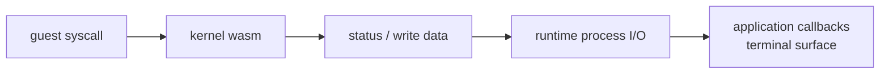
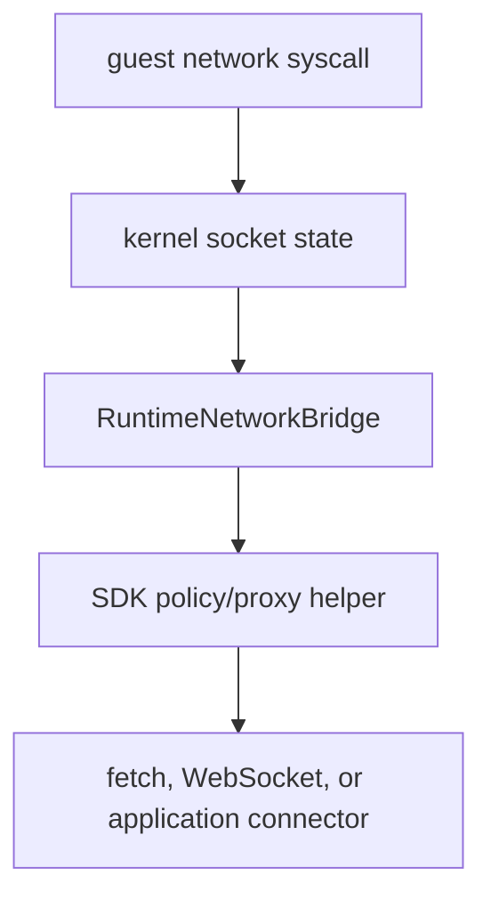

# Host Integration

Host integration is the part of Tidemark that connects guest execution to
browser or Node capabilities without making those host APIs part of kernel
semantics.

## Worker And Shared-Memory Requirements

The runtime uses browser/Node worker infrastructure to isolate and schedule
kernel execution roles:

- a kernel worker for canonical runtime-facing state,
- process owner workers for lifecycle and scheduling,
- thread workers for guest thread execution,
- host bridges for stdio, filesystem requests, and network connections.

SharedArrayBuffer and Atomics are core runtime substrates because threaded guest
execution and cross-worker state coordination need shared memory and wakeup
behavior. The kernel should not depend on browser worker APIs directly; it sees
WebAssembly memory, exported functions, and status transitions.

## Stdio And Process I/O

The runtime exposes stdout callbacks, stdin writes, PTY or pipe stdio modes,
and process result events. These are host integration surfaces. They carry guest
I/O across worker boundaries, but they do not define Linux syscall semantics.

## Network Bridge

The runtime exposes a generic network bridge contract. The SDK can build policy
and proxy helpers on top of that contract with browser `fetch`, WebSocket
tunnels, or application-provided connectors.

The current public surface includes runtime network bridge types, HTTP
injection support, SDK policy fetch helpers, HTTP proxy bridge helpers, proxy
environment helpers, and WebSocket tunnel connector helpers. Tests should
verify generic policy, proxy, and tunnel behavior without package-manager-
specific branching.

Network policy belongs above the runtime bridge. A package manager, language
tool, registry, mirror, or product allowlist can be expressed through SDK or
application policy without adding workload-specific branches to kernel or
generic runtime code.

## Browser And Node Environments

The runtime and SDK support both browser-style and Node-compatible execution
surfaces where the required primitives are available. The important contract is
not the host brand; it is whether the host provides the worker, WebAssembly,
SharedArrayBuffer, Atomics, fetch, WebSocket, and integration APIs required by
the chosen features.
