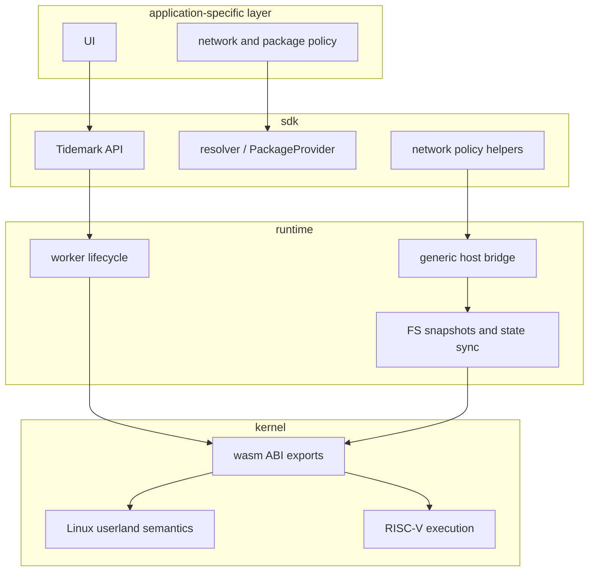

# Layer Boundaries

Layer boundaries define what belongs in each public implementation repository
and what should remain in application or provider code.

## Ownership Matrix

| Concern | Kernel | Runtime | SDK |
|---|---|---|---|
| RISC-V instruction behavior | Owns | Uses through wasm exports | Does not own |
| ELF loading | Owns | Supplies executable bytes | Resolves executable path and bytes |
| Linux syscall behavior | Owns | Orchestrates blocking and state movement | Does not define |
| Worker lifecycle | Does not own | Owns | Uses |
| Process orchestration | Defines guest-visible effects | Owns browser-side lifecycle and scheduling | Provides high-level process API |
| Filesystem semantics | Owns guest-visible memfs/fd behavior | Owns runtime snapshots and RPC | Applies files and file layers |
| Package resolution | Does not own | Does not own | Owns provider abstraction |
| Network policy | Does not own | Exposes bridge substrate | Exposes policy/proxy helpers |
| Product UI | Does not own | Does not own | May help integration |

## Boundary Diagram

## Practical Rules

Kernel changes should be justified by RISC-V, ELF, memory, filesystem, process,
signal, socket, thread, or Linux userland compatibility behavior.

Runtime changes should be justified by worker orchestration, state
synchronization, process lifecycle, host bridge, filesystem snapshot, or
network bridge behavior.

SDK changes should be justified by application ergonomics, provider interfaces,
network policy integration, terminal integration, or host tooling.

Application and provider code can know package names, registry names, mirror
choices, cache policy, and UI behavior.

## Anti-Coupling Rule

A lower layer should not branch on a product or workload name. In practice:

- Kernel should not need to know whether a file came from Node.js, Go, apt, or
  a static layer.
- Runtime should not need package-manager-specific code to coordinate workers.
- SDK providers may know package and layer identities, because that is their
  job.

This keeps compatibility behavior testable independently from product
provisioning policy.
