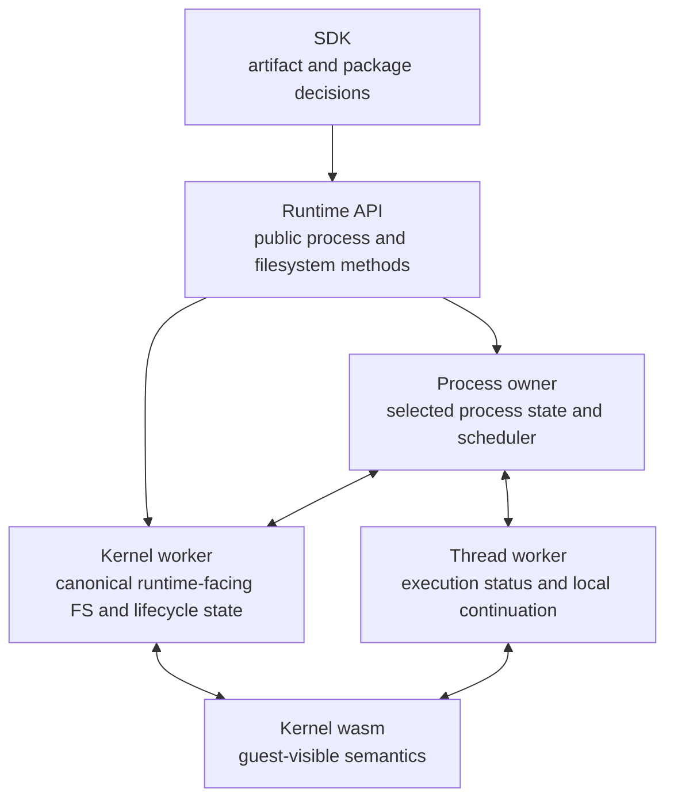
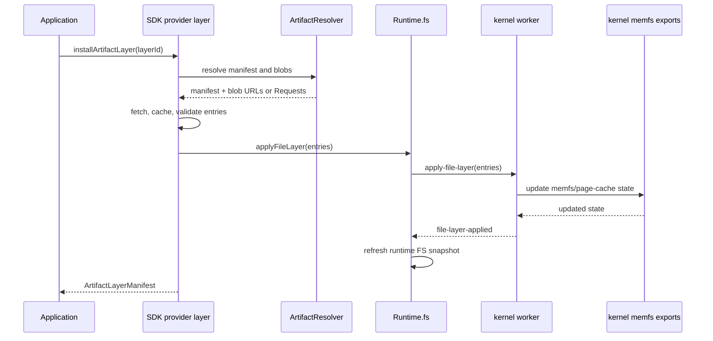
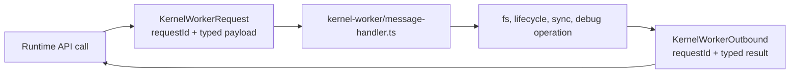
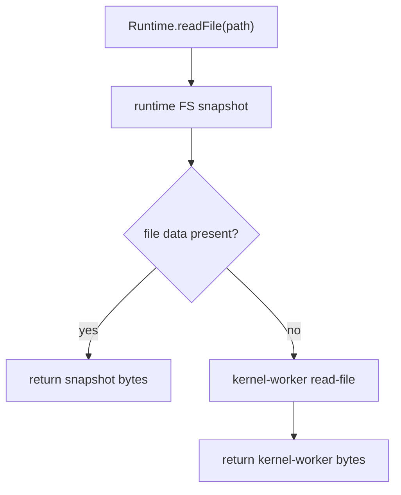
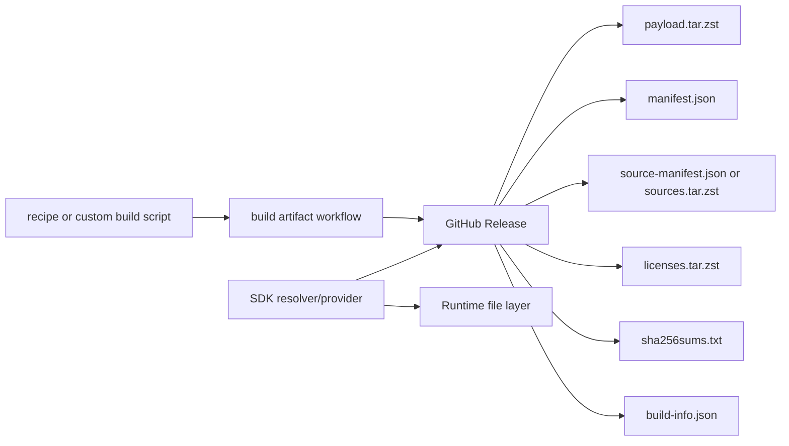

# State And Filesystem

Tidemark's runtime has to keep browser-side worker state and kernel-visible
guest state coherent. This page explains the current state boundaries.

## State Owners

The kernel defines guest-visible semantics. The runtime moves state between
workers so those semantics can survive browser worker boundaries and async host
events.

## Filesystem Layers

The runtime exposes filesystem operations such as write, bulk write, symlink,
read, readlink, mkdir, stat, readdir, snapshot loading, and file layer
application. The SDK builds on that with artifact and package provider flows.

The SDK provider interfaces let applications choose where artifact data comes
from. The runtime receives concrete file layer entries; it does not need to know
which package manager or registry produced them.

## Kernel-Worker RPC

The runtime uses request ids for kernel-worker RPCs so filesystem and lifecycle
operations can be pipelined safely. The current request set includes:

- kernel initialization,
- single and bulk file writes,
- file layer application,
- symlink creation,
- read-file and readlink,
- mkdir, stat, and readdir,
- filesystem snapshot load and snapshot export,
- process registration and lifecycle operations,
- blocked syscall resume paths,
- process and page-cache debug operations.

This is a contract, not an implementation detail hidden behind a single mutable
global object.

## Snapshot Categories

The runtime message types show which state must cross worker boundaries:

| Snapshot or state | Purpose |
|---|---|
| `KernelRuntimeState` | Kernel-visible runtime state passed between kernel and workers. |
| fd entry snapshots | File descriptor to open-file-description mapping and fd flags. |
| OFD slot snapshots | Open file description state needed across process transitions. |
| pipe slot snapshots | Pipe control state and data-plane coordination. |
| socket state snapshots | Socket table and network buffer state. |
| guest memory write snapshots | Guest memory changes that must be replayed or synchronized. |
| kernel memory write snapshots | Kernel-side memory changes surfaced from execution. |
| child-exit records | Parent-visible child lifecycle records for wait-style behavior. |
| fork stack snapshots | Stack state needed across fork-style transitions. |

These categories explain why process orchestration is a central runtime
responsibility. Browser workers isolate execution, but guest processes expect a
coherent Linux-like process and file descriptor model.

## Runtime Filesystem Read Path

Runtime reads first use the most recent published runtime filesystem snapshot
when possible. If the entry is unavailable or stale, the runtime asks the kernel
worker through `read-file`.

This read path exists alongside explicit mutation paths that refresh the runtime
snapshot after writes, symlinks, directory creation, and layer application.

## Artifact Release State

Artifact releases include payload and metadata assets. The artifacts repository
validates recipe and release structure, while the SDK decides how to resolve and
apply those assets.

The payload's upstream license remains attached to the payload. Publishing a
payload as a Tidemark artifact does not change that upstream license.
