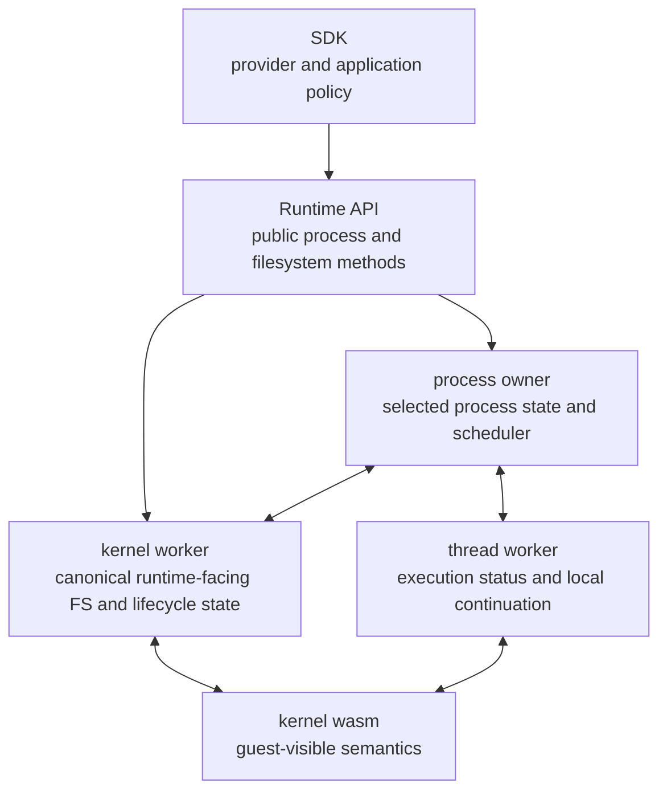
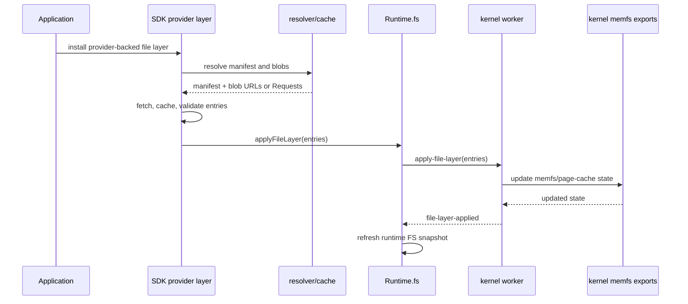
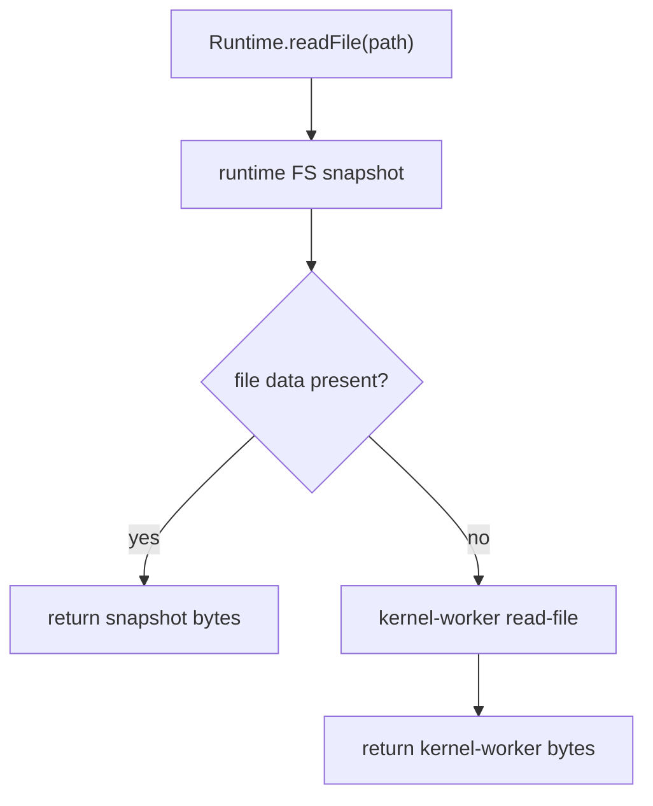
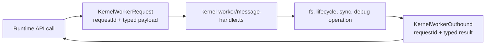
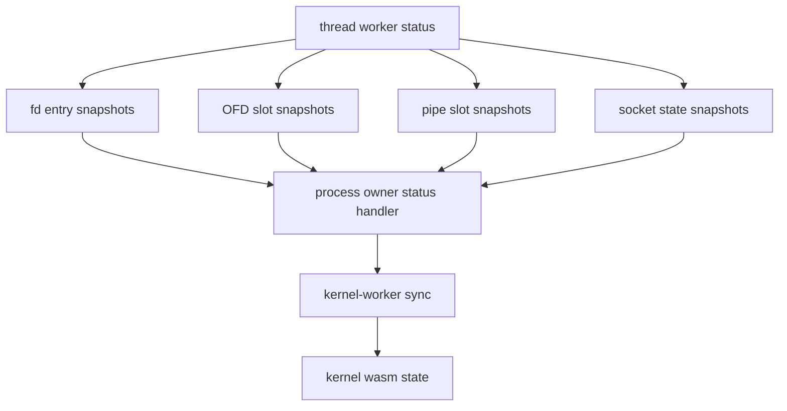

# State Model

Tidemark's runtime has to keep browser-side worker state and kernel-visible
guest state coherent. The state model defines what is owned by the kernel,
what is mirrored or transported by the runtime, and what is only application or
SDK policy.

## State Owners

The kernel defines guest-visible semantics. The runtime moves state between
workers so those semantics can survive browser worker boundaries and async host
events.

## Shared Memory And Page Cache

The runtime allocates a SharedArrayBuffer-backed page cache during
`Runtime.create` and passes it to kernel worker and process creation paths. The
kernel environment receives that page cache when WebAssembly instances are
created.

Implementation evidence:

- `runtime/src/index.ts` allocates `sabPageCache` with `new
  SharedArrayBuffer(this.ramSize)` and sends it to kernel initialization and
  process creation.
- `runtime/src/kernel-worker/process-control.ts` passes the page cache into
  `createKernelEnv`.
- `runtime/src/kernel-worker/` exposes page-cache debug and rebuild paths.
- `runtime/src/messages.ts` includes `sabPageCache`, `snapshot-fs`,
  `load-fs-snapshot`, and page-cache debug messages.

The page cache is not an application-visible storage API. It is part of the
runtime/kernel substrate used to make filesystem and process state visible
across workers.

## Filesystem Layers And Snapshots

The runtime exposes filesystem operations such as write, bulk write, symlink,
read, readlink, mkdir, stat, readdir, snapshot loading, and file layer
application. The SDK builds on that with resolver, cache, and provider flows.

The SDK provider interfaces let applications choose where file layer data comes
from. The runtime receives concrete entries; it does not need to know which
package manager, registry, or upstream system produced them.

## Runtime Filesystem Read Path

Runtime reads first use the most recent published runtime filesystem snapshot
when possible. If the entry is unavailable or stale, the runtime asks the kernel
worker through `read-file`.

This read path exists alongside explicit mutation paths that refresh the runtime
snapshot after writes, symlinks, directory creation, and layer application.

## Kernel-Worker RPC

The runtime uses request ids for kernel-worker RPCs so filesystem and lifecycle
operations can be pipelined safely. The current request set includes:

- kernel initialization,
- single and bulk file writes,
- file layer application,
- symlink creation,
- read-file and readlink,
- mkdir, stat, and readdir,
- filesystem snapshot load and snapshot export,
- process registration and lifecycle operations,
- blocked syscall resume paths,
- process and page-cache debug operations.

This is a contract, not an implementation detail hidden behind a single mutable
global object.

## Snapshot Categories

The runtime message types show which state must cross worker boundaries:

| Snapshot or state | Purpose |
|---|---|
| `KernelRuntimeState` | Kernel-visible runtime state passed between kernel and workers. |
| fd entry snapshots | File descriptor to open-file-description mapping and fd flags. |
| OFD slot snapshots | Open file description state needed across process transitions. |
| pipe slot snapshots | Pipe control state and data-plane coordination. |
| socket state snapshots | Socket table and network buffer state. |
| guest memory write snapshots | Guest memory changes that must be replayed or synchronized. |
| kernel memory write snapshots | Kernel-side memory changes surfaced from execution. |
| child-exit records | Parent-visible child lifecycle records for wait-style behavior. |
| fork stack snapshots | Stack state needed across fork-style transitions. |

These categories explain why process orchestration is a central runtime
responsibility. Browser workers isolate execution, but guest processes expect a
coherent Linux-like process and file descriptor model.

## FD, OFD, Pipe, And Socket Synchronization

The implementation treats file descriptor and kernel-object state as structured
state, not as loose JavaScript side data.

Implementation evidence:

- `kernel/kernel/src/abi.rs` exposes fd and OFD accessors such as
  `process_fd_ofd_id`, fd flags, and kernel OFD entry points.
- `runtime/src/thread-worker.ts` snapshots fd/OFD, pipe, socket, memory, and
  sync-effect data when execution stops.
- `runtime/src/worker/message-handler/status.ts` applies fd/OFD, pipe, socket,
  child-exit, and sync-effect data from thread-worker status messages.
- `runtime/src/worker/kernel-share/` contains shared-state synchronization
  helpers for fork and process transitions.

This structure is what lets thread execution, process ownership, and kernel
worker state converge after a blocking syscall, fork-style transition, network
operation, or file mutation.
