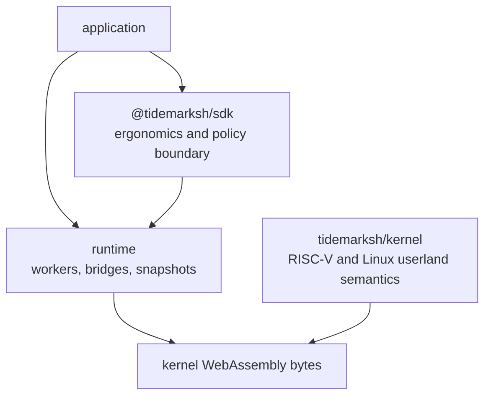
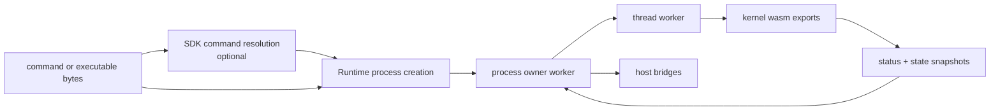

# System Model

Tidemark is split into three public implementation layers:

- `kernel`: the guest-visible RISC-V and Linux userland compatibility core.
- `runtime`: the browser/Node orchestration layer around kernel WebAssembly.
- `sdk`: the application-facing layer for setup, command execution, providers,
  and host policy integration.

The dependency direction is intentionally one-way. Higher layers use lower
layers; lower layers do not learn product policy, package manager names, or
application UI concepts.

The runtime does not import the Rust kernel crate directly. It receives kernel
WebAssembly bytes through `Runtime.create`, instantiates them in workers, and
talks to the kernel through explicit exports and typed messages.

## Control Planes

| Plane | Current owner | Examples |
|---|---|---|
| Guest execution semantics | Kernel | RISC-V decode/dispatch, ELF loading, syscall behavior, guest memory access. |
| Kernel ABI exports | Kernel | Status constants, syscall constants, fd/socket constants, thread and process entry points. |
| Worker orchestration | Runtime | Kernel worker, process owner workers, thread workers, worker pool. |
| Runtime state movement | Runtime | `KernelRuntimeState`, fd/OFD snapshots, pipe slots, socket state snapshots, child-exit records. |
| Filesystem layering | Runtime and SDK | Runtime snapshots and file layer application; SDK provider installation flows. |
| Product and provider policy | SDK or application | Package provider choice, network policy, origin policy, UI behavior. |

## Shape Of A Guest Run

This model lets applications use a high-level SDK without forcing the kernel or
generic runtime to contain package-manager or workload-specific branches.
