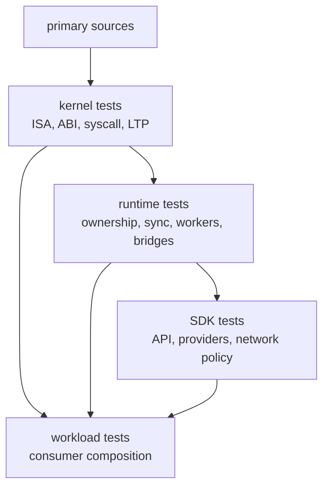

# Testing Strategy

Tidemark tests should prove the layer that owns the behavior. A workload test
is valuable, but it should not replace the lower-level gate that explains why
the workload is expected to pass.

## Test Ownership By Layer

## Kernel Tests

Kernel tests should establish guest-visible semantics.

Current forms include:

- `kernel/tests/tests/riscv/` for RISC-V execution coverage.
- `kernel/tests/tests/syscall/` for syscall families.
- `kernel/tests/fixtures/ltp/` for LTP classification.
- kernel ABI/export tests for the WebAssembly boundary.
- Wasmtime-based execution support for kernel WebAssembly tests.

Kernel tests are the right place to prove instruction behavior, ELF behavior,
syscall semantics, fd rules, memory mapping, signal behavior, process rules,
and socket/pipe semantics.

## Runtime Tests

Runtime tests should establish ownership and orchestration behavior.

Current forms include:

- `runtime/tests/runtime/` for generic runtime invariants.
- `runtime/tests/workloads/` for guest workload checks.
- `runtime/tests/support/` for shared harnesses and snapshot helpers.

Runtime invariant tests cover public API behavior, bridge state, filesystem and
page-cache synchronization, kernel-worker lifecycle, thread-worker execution,
blocking/resume, scheduler behavior, stdio, process identity, kernel RPC, fork,
execve, and ownership transitions.

Workload tests should confirm that those ownership gates compose under realistic
guest software. They should not be used to justify package-manager-specific
branches in kernel or generic runtime code.

## SDK Tests

SDK tests should establish API, provider, and policy behavior.

Current forms include:

- `sdk/tests/index.test.ts` for main API behavior.
- `sdk/tests/provisioning.test.ts` for resolver, cache, and provider behavior.
- `sdk/tests/network.test.ts` for policy fetch, HTTP proxy, and tunnel helpers.
- `sdk/tests/node-relay.test.ts` for Node relay support.
- provider integration tests that use runtime contracts when needed.

SDK tests can reference package ecosystems or provider metadata because that is
the SDK's policy layer. They should not redefine kernel syscall semantics or
runtime worker ownership rules.
