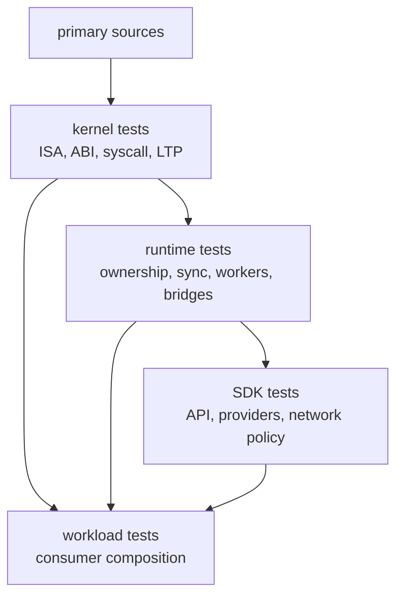

# Testing Strategy

Tidemark tests are organized around the layer that owns the behavior. A
workload test is valuable, but it does not replace the lower-level gate that
explains why the workload is expected to pass.

## Test Ownership By Layer

## Kernel Tests

Kernel tests should establish guest-visible semantics.

Current forms include RISC-V execution coverage, syscall-family coverage, LTP
classification, ABI/export tests for the WebAssembly boundary, and
Wasmtime-based execution support for kernel WebAssembly tests.

Kernel tests are the right place to prove instruction behavior, ELF behavior,
syscall semantics, fd rules, memory mapping, signal behavior, process rules,
and socket/pipe semantics.

## Runtime Tests

Runtime tests should establish ownership and orchestration behavior.

Current forms include generic runtime invariant tests, guest workload checks,
and shared harnesses for workload and snapshot verification.

Runtime invariant tests cover public API behavior, bridge state, filesystem and
page-cache synchronization, kernel-worker lifecycle, thread-worker execution,
blocking/resume, scheduler behavior, stdio, process identity, kernel RPC, fork,
execve, and ownership transitions.

Workload tests should confirm that those ownership gates compose under realistic
guest software. They should not be used to justify package-manager-specific
branches in kernel or generic runtime code.

## SDK Tests

SDK tests should establish API, provider, and policy behavior.

Current forms include main API behavior, resolver/cache/provider behavior,
policy fetch behavior, HTTP proxy behavior, tunnel helpers, Node relay support,
and provider integration tests that use runtime contracts when needed.

SDK tests can reference package ecosystems or provider metadata because that is
the SDK's policy layer. They should not redefine kernel syscall semantics or
runtime worker ownership rules.
