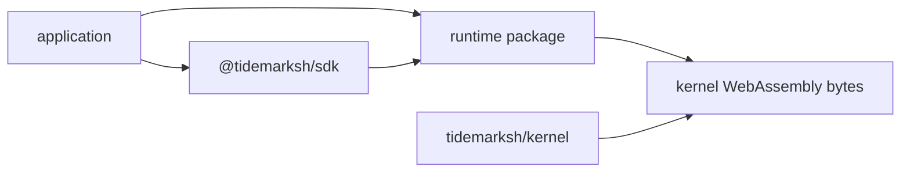
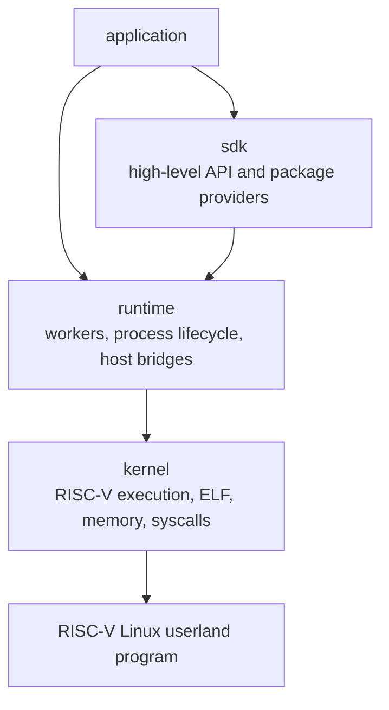

# Tidemark

Tidemark is a browser-hosted RISC-V Linux userland environment.

This site explains repository boundaries, current implementation structure, and
the contracts between layers.

## Repositories

| Repository | Primary language | Current role |
|---|---|---|
| [kernel](https://github.com/tidemarksh/kernel) | Rust | RISC-V Linux userland kernel compiled for WebAssembly targets. |
| [runtime](https://github.com/tidemarksh/runtime) | TypeScript | Browser worker runtime that runs guest processes on top of the kernel. |
| [sdk](https://github.com/tidemarksh/sdk) | TypeScript | Higher-level API for applications using the runtime. |

The dependency direction is intentionally one-way:

The current SDK package depends on the local runtime package in the workspace.
The runtime expects kernel WebAssembly bytes at creation time.

## What Tidemark Is

Tidemark is not a full virtual machine monitor and it is not a browser operating
system. The current implementation focuses on running RISC-V Linux userland
programs inside WebAssembly and browser worker infrastructure.

It can be used as an application-embedded guest execution environment for
running Linux userland binaries, command-line tools, language runtimes, build
steps, package-backed file layers, and terminal-like workflows inside a browser
or compatible worker host. The value is not only CPU emulation; it is the
combination of guest execution, filesystem state, process orchestration, stdio,
network bridge hooks, and SDK-level provisioning.

At a high level, Tidemark separates guest semantics from browser orchestration
and product-level provisioning:

## Current Scope

The repositories currently contain implementation code for:

- RISC-V instruction execution and ELF loading in the kernel.
- Linux userland syscall, filesystem, process, thread, signal, pipe, socket,
  and time-related modules in the kernel.
- Runtime worker orchestration, process lifecycle handling, file snapshots,
  SharedArrayBuffer page cache support, network bridge interfaces, and debug
  helpers.
- SDK helpers for creating a runtime, adding files, running commands, resolving
  package providers, and attaching a simple terminal.

For a deeper description, start with [Architecture](architecture.md).

## License

The kernel, runtime, and SDK repositories are licensed under Apache-2.0.
