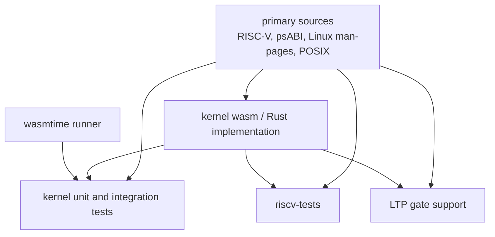

# Kernel

Repository: [tidemarksh/kernel](https://github.com/tidemarksh/kernel)

Tidemark Kernel owns guest-visible RISC-V and Linux userland behavior. It is the
semantic layer of the system: if a guest program observes an instruction result,
ELF layout, syscall return value, signal frame, file descriptor rule, memory
mapping, pipe behavior, or socket behavior, that behavior belongs here.

The kernel is written in Rust and targets WebAssembly. The crate is configured
to use `no_std` for `wasm32-unknown-unknown`, because the kernel cannot depend
on host operating-system services directly.

## Design Intent

The kernel is designed as a compatibility core, not as a browser integration
layer.

Its responsibilities are:

- Execute RISC-V userland code.
- Load ELF binaries and prepare guest process state.
- Provide guest memory access and memory mapping behavior.
- Implement Linux userland syscall semantics where supported.
- Own guest-visible filesystem, fd/OFD, process, signal, socket, pipe, thread,
  and time behavior.
- Export a WebAssembly ABI that the runtime can call.

The kernel should not know about browser workers, package managers, registries,
application UI, CDN paths, or product policy. Those concerns sit above the
kernel.

## Reference Sources

Kernel behavior should be grounded in primary sources. The current reference
set is:

| Area | Reference source |
|---|---|
| RISC-V ISA | [RISC-V ratified specifications](https://docs.riscv.org/reference/home/index.html) |
| RISC-V ELF and calling convention | [RISC-V ELF psABI document](https://github.com/riscv-non-isa/riscv-elf-psabi-doc) |
| Linux syscalls | [Linux man-pages project](https://man7.org/linux/man-pages/) |
| Portable system interfaces | [POSIX System Interfaces](https://pubs.opengroup.org/onlinepubs/9799919799/functions/contents.html) |
| WebAssembly execution target | [WebAssembly specifications](https://webassembly.org/specs/) |
| RISC-V ISA tests | [riscv-tests](https://github.com/riscv-software-src/riscv-tests) |
| Linux compatibility tests | [Linux Test Project](https://github.com/linux-test-project/ltp) |

Workload traces are useful for debugging, but they should not be the authority
for syscall, ABI, ISA, or compatibility behavior. A workload may expose a bug;
the fix still needs to reconcile with the relevant source.

## Compatibility Philosophy

The kernel is not trying to implement a full Linux kernel. It implements the
guest-visible subset needed by Linux userland programs in this environment.

The useful distinction is:

- **Semantic compatibility**: guest-visible behavior should match the relevant
  RISC-V, ELF, Linux, or POSIX rule where supported.
- **Host implementation strategy**: the way the browser runtime schedules
  workers or stores data can differ from Linux internals.

That distinction lets the project implement Linux-like behavior without
pretending that a browser worker graph is a native Linux kernel.

## ABI Boundary

The WebAssembly export boundary is the kernel's contract with the runtime. The
runtime can instantiate the kernel, create process/thread state, step
execution, inspect status codes, synchronize filesystem/process state, and use
debug or harness exports when those are explicitly available.

This ABI should stay generic. It should not include branches for a package
manager, language runtime, registry URL, or application-specific path.

## Test Strategy

Kernel tests are organized by semantic area rather than by application
workload.

Current test forms include:

- ABI/export tests for the WebAssembly-facing contract.
- CPU and block-cache tests.
- RISC-V ISA tests through the vendored `riscv-tests` source.
- Filesystem tests for fd table, memfs, and ring buffers.
- Network ring buffer tests.
- Syscall family tests for epoll, fs, identity, memory, pipe, process,
  resource, signal, socket, thread, and time behavior.
- LTP-oriented gate support for Linux compatibility classification.
- Wasmtime-based test runner support for WebAssembly execution.

The important test rule is that consumer workloads are not the first proof of
kernel correctness. They are useful after focused kernel gates have established
the relevant semantic behavior.

## What Belongs In Kernel Reviews

Kernel review should focus on:

- whether the behavior matches the appropriate specification,
- whether the guest-visible ABI is stable and explicit,
- whether unsafe memory access is localized and justified,
- whether syscall behavior is tested at the semantic boundary,
- whether runtime coordination concerns are leaking into kernel code.

If a proposed change depends on a command name, package manager, repository URL,
or product policy, it belongs outside the kernel.
