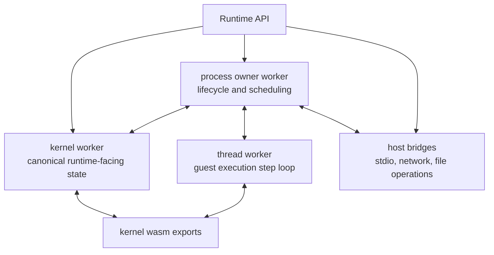
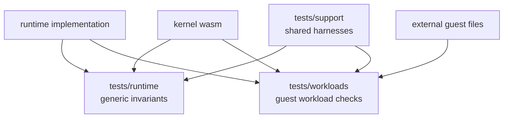

# Runtime

Repository: [tidemarksh/runtime](https://github.com/tidemarksh/runtime)

Tidemark Runtime owns browser-side execution orchestration. It is the layer that
turns kernel WebAssembly exports into running guest processes by coordinating
workers, process handles, filesystem snapshots, stdio, network bridges, and
state synchronization.

The runtime is written in TypeScript. The current package metadata identifies
the package as `runtime` at version `0.0.0`.

## Design Intent

The runtime is deliberately not the Linux semantic authority. It should not
decide what a syscall means. Its job is to preserve the kernel's guest-visible
state across browser execution boundaries.

Its responsibilities are:

- Instantiate kernel WebAssembly bytes.
- Create and manage the kernel worker.
- Create process owner workers and thread workers.
- Move explicit state snapshots between workers.
- Coordinate process lifecycle, blocking, resume, fork/vfork/execve, and exit
  events.
- Expose generic filesystem operations and file layer application.
- Bridge stdout, stdin, PTY/pipe modes, and network connections to the host
  application.
- Provide diagnostics without making diagnostics define production semantics.

## Reference Sources

Runtime design is grounded in platform APIs and the kernel ABI, not in
workload-specific behavior.

| Area | Reference source |
|---|---|
| WebAssembly host integration | [WebAssembly specifications](https://webassembly.org/specs/) and browser WebAssembly APIs |
| Shared memory substrate | [SharedArrayBuffer](https://developer.mozilla.org/en-US/docs/Web/JavaScript/Reference/Global_Objects/SharedArrayBuffer) and `Atomics` |
| Worker execution model | [Web Workers API](https://developer.mozilla.org/en-US/docs/Web/API/Web_Workers_API) |
| Node-compatible worker execution | [Node.js worker_threads](https://nodejs.org/api/worker_threads.html) |
| Guest semantics | Kernel WebAssembly ABI and kernel tests |

The runtime can use workload failures to locate orchestration bugs, but generic
runtime behavior should not branch on package manager names, language runtime
names, URL shapes, or registry behavior.

## Execution Model

The runtime has three main execution roles:

This topology exists because guest programs expect process, fd/OFD, pipe,
socket, filesystem, and signal state to remain coherent even though the browser
isolates execution across workers and asynchronous host events.

## State Synchronization Philosophy

Runtime state movement is explicit. The runtime message contracts include
kernel state, fd snapshots, OFD snapshots, pipe slots, socket state, child-exit
records, guest memory writes, and blocking/resume hints.

That is intentional. The runtime should make ownership transitions visible
rather than hide them behind broad global mutation.

Examples of runtime-owned coordination:

- parent/child process lifecycle,
- selected process ownership,
- fork and vfork/execve ordering,
- worker-local wait and resume,
- fd/OFD and pipe state sync,
- runtime filesystem snapshot publication,
- network bridge connection lifecycle.

## Threaded Guest Workloads

Thread workers are not only an implementation detail for parallel JavaScript
execution. They are the runtime mechanism that maps guest thread execution onto
browser or Node worker infrastructure while keeping shared process memory and
kernel-visible state coherent.

Each thread worker executes a guest thread step loop against the process memory
prepared by the process owner. When execution stops, the thread worker returns
structured state: status, registers, syscall details, fd/OFD snapshots, pipe
slots, socket state, memory writes, child-exit records, and sync effects. The
process owner uses that state to continue, block, resume, synchronize with the
kernel worker, or publish lifecycle changes.

This is the substrate needed by threaded Linux userland workloads such as
language runtimes, compiler drivers, build tools, thread pools, futex waits,
and signal-aware runtimes. Those workloads exercise the same generic runtime
design; the runtime should not contain language-specific threading logic.

## Test Strategy

Runtime tests are organized by what they verify, not by helper language or file
location.

The current test structure has three major families:

- `tests/runtime/`: generic runtime invariants and ownership boundaries.
- `tests/workloads/`: language, runtime, and toolchain workload checks.
- `tests/support/`: shared harness code for workload and snapshot tests.

Current runtime invariant tests cover:

- public Runtime and Process API behavior,
- bridge and runtime-state behavior,
- filesystem and page-cache synchronization,
- kernel-worker lifecycle and primitive state,
- thread-worker execution, blocking, session, signal, and sync-effect behavior,
- worker lifecycle, scheduler, status handling, stdio, process identity,
  kernel RPC, fork, execve, and ownership transitions.

Current workload tests cover broad guest behavior across shells, dynamic
startup, script runtimes, package module drivers, toolchains, large file I/O,
network streams, and language/runtime-specific startup or toolchain execution.

The invariant tests should lead. Workload tests are valuable, but they should
confirm behavior after the relevant runtime ownership or synchronization gate is
understood.

## What Belongs In Runtime Reviews

Runtime review should focus on:

- worker ownership and lifecycle ordering,
- whether state synchronization is targeted and explicit,
- whether blocking/resume behavior preserves kernel-visible state,
- whether diagnostics remain read-only,
- whether network and filesystem bridge code stays generic,
- whether workload-specific policy has leaked below SDK/provider boundaries.
