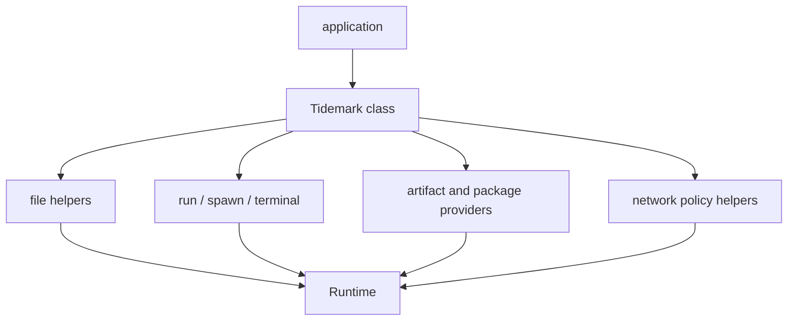
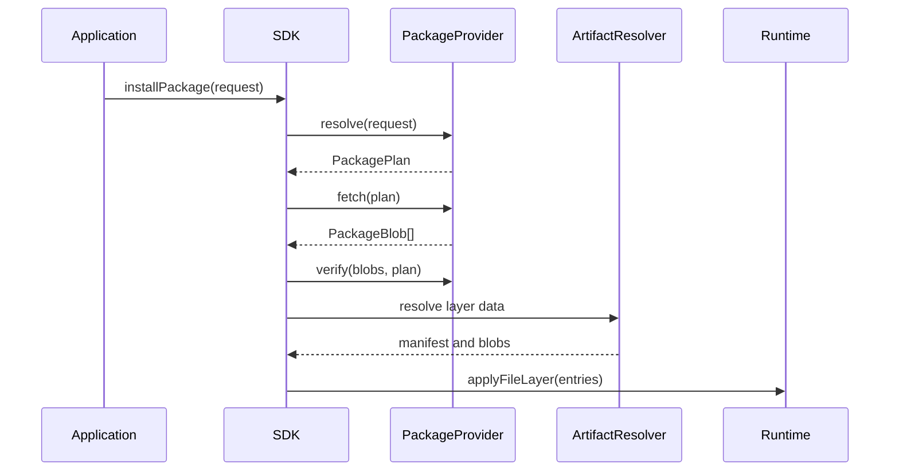
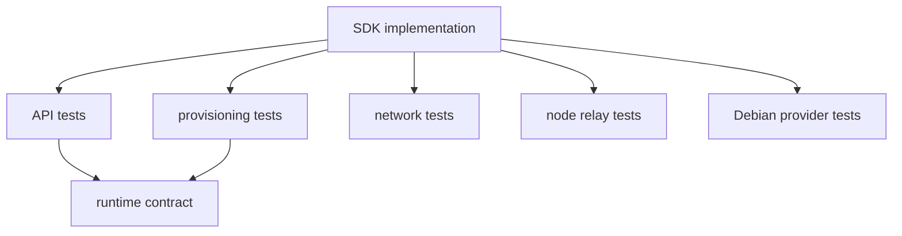

# SDK

Repository: [tidemarksh/sdk](https://github.com/tidemarksh/sdk)

Tidemark SDK owns the application-facing API on top of the runtime. It turns the
lower-level runtime contract into a smaller surface for creating an environment,
adding files, running commands, applying file layers, connecting terminals, and
configuring package or network providers.

The current package name is `@tidemarksh/sdk` at version `0.0.0`. Its current
workspace dependency points to the local `runtime` package.

## Design Intent

The SDK is the policy and ergonomics layer. It should make common application
flows straightforward without changing kernel semantics or hiding runtime
ownership rules.

Its responsibilities are:

- Create a runtime with sensible defaults.
- Normalize guest paths and default environment values.
- Provide high-level file and directory helpers.
- Resolve command names through a guest `PATH`.
- Run or spawn guest processes.
- Connect a basic terminal surface.
- Install validated file layers through resolvers and caches.
- Expose package provider interfaces.
- Expose network policy and proxy integration helpers.

The SDK may know about provider choices, package names, layer identities, cache
policy, and host integration. Kernel and generic runtime code should not.

## API Philosophy

The SDK should be thin enough that advanced users can still drop down to the
runtime, but complete enough that application code does not need to manually
wire common process and file operations.

The SDK does path resolution and command loading before calling `Runtime.spawn`.
For scripts, it can route simple shebang cases through `/bin/sh` by loading the
shell from the guest filesystem.

## Provider Model

Provider interfaces keep distribution policy above the runtime:

- `ArtifactResolver` resolves layer manifests and blobs.
- `ArtifactCache` controls local cache behavior.
- `PackageProvider` resolves a package request, fetches provider data, verifies
  it when supported, and applies it to a target.
- Static layer and Debian-oriented providers are implemented as SDK/provider
  policy, not as kernel or runtime behavior.

This design lets package/provider support grow without adding package-specific
branches to the kernel or generic runtime.

## Reference Sources

The SDK depends primarily on project contracts and web platform APIs:

| Area | Reference source |
|---|---|
| Runtime behavior | Runtime public API and exported types |
| Browser fetch and request objects | [Fetch API](https://developer.mozilla.org/en-US/docs/Web/API/Fetch_API) |
| Browser network tunnel substrates | [WebSocket API](https://developer.mozilla.org/en-US/docs/Web/API/WebSockets_API) |
| Package provider behavior | Provider-specific upstream metadata and package formats |
| Guest execution semantics | Kernel and runtime contracts, not SDK policy |

Provider-specific code can reference package ecosystem formats. That does not
make those formats runtime or kernel semantics.

## Test Strategy

SDK tests validate API behavior and provider policy boundaries.

Current test forms include:

- main SDK API tests,
- provisioning tests,
- network helper tests,
- Node relay tests,
- Debian live provider tests,
- Debian materialized provider tests.

The key testing distinction is that SDK tests should prove provider and API
behavior. They should not be used to define Linux syscall semantics or runtime
worker ownership rules.
